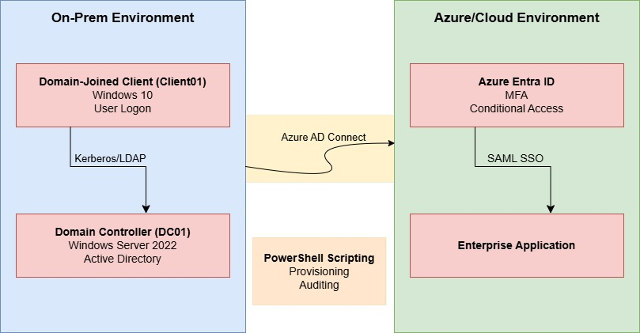

# Hybrid Identity & Access Management Lab
## Table of Contents
- [Overview](#overview)
- [Architecture Overview](#architecture-overview)
- [Identity Design & Lifecycle](#identity-design--lifecycle)
- [Access Controls](#access-controls)
  - [Conditional Access & MFA](#conditional-access--mfa)
  - [SSO Implementation](#sso-implementation)
  - [RBAC, Least Privilege and Group Policies](#rbac-least-privilege-and-group-policies)
- [Automation & Scripting](#automation--scripting)
  - [User Provisioning Automation](#user-provisioning-automation)
  - [Privileged Role Auditing Automation](#privileged-role-auditing-automation)
- [Outcomes & What This Demonstrated](#outcomes--what-this-demonstrated)
- [Challenges, Limitations & Lessons Learned](#challenges-limitations--lessons-learned)
- [Future Improvements](#future-improvements)

## Overview
This lab is a hybrid Identity and Access Management (IAM) environment designed to simulate real-world enterprise identity architecture. It utilises Active Directory and Microsoft Entra ID for identity management, PowerShell for scripting and automation, and modern access controls including Multi-Factor Authentication (MFA), Conditional Access (CA) and SAML-based Single Sign-On (SSO). The environment reflects common enterprise IAM patterns, identity flows, and access control mechanisms.

## Architecture Overview
The environment consists of two virtual machines: a domain controller (DC01) hosting Active Directory, and a domain-joined client device (Client01) used to access domain and cloud resources. An Entra ID tenant was established to provide cloud-based identity services, with Azure AD Connect configured to synchronise identities from DC01 using Password Hash Synchronisation (PHS) 

Within Entra ID, MFA, Conditional Access and SAML-based SSO were implemented to control access to cloud resources. PowerShell scripts were also developed to automate identity-related tasks such as user provisioning and privileged role auditing, with selected scripts executed automatically via Windows Task Scheduler.

A high-level architecture diagram is provided below to illustrate identity and authentication flows.

## Identity Design & Lifecycle
In this IAM environment, user identities are provisioned on-premises via an automated PowerShell user creation script [Create User](../Scripts/Create%20User.ps1) and placed within a dedicated "Employees" Organisational Unit (OU) ([Active Directory Users](Images/AD_Users.png)). Client devices are domain-joined to enforce centralised identity controls, group policies, and access to domain resources. 

Azure AD Connect is used to synchronise identities between the on-premises domain and the Entra ID tenant, with Password Hash Synchronisation (PHS) configured to enable cloud authentication. During implementation, password synchronisation initially failed due to the Entra sync service account lacking the "Replicating Directory Changes" and "Replicating Directory Changes All" permissions with Active Directory. Granting these permissions resolved the synchronisation issue and restored expected behaviour. Following successful Password Hash Synchronisation, synced users are visible within Entra ID ([Entra ID Users](Images/Azure_Users.png)).

User lifecycle events such as departmental or role changes are handled through group membership updates, where users are removed from preliminary access groups (e.g., "G-DEPARTMENT All Users") and added to appropriate role-based groups. Once an account is no longer required, the user is removed from access groups (excluding the default "Domain Users"), disabled, and moved to a designated "Disabled Users" OU to maintain directory hygiene and prevent unauthorised access.

## Access Controls
### Conditional Access & MFA
Conditional Access (CA) and Multi-Factor Authentication (MFA) were implemented to secure access to cloud resources. MFA was configured as mandatory for all users to provide an additional authentication factor beyond username and password. Conditional Access enables adaptive authentication, complementing MFA instead of relying solely on static enforcement.

For testing purposes, a Conditional Access policy was created to evaluate access restrictions based on network trust and device platform. The policy aimed to block login attempts to Microsoft 365 services originating from untrusted networks, specifically targeting clients running Windows, macOS, iOS, or Android.

All policies were initially deployed in Report-Only mode to validate behaviour and prevent administrative lockout. Successful MFA challenges were confirmed during SaaS authentication attempts ([MFA prompt](Images/MFA_Prompt.png)). After reviewing sign-in logs and confirming expected results, the policies were enforced. Depending on the target resource, access could be further restricted by requiring device registration, additional authentication prompts, or tighter network conditions.

### SSO Implementation
SAML-based Single Sign-On (SSO) was implemented to demonstrate federated authentication for SaaS applications. For testing purposes, the "SAML ToolKit for Azure AD" enterprise application was configured to allow SSO access only to selected users.

The application simplified configuration by providing required SAML metadata, including identifiers and reply URLs ([SSO Config](Images/SSO_Config.png)). Authentication was tested using two users:
- Alice, who was granted SSO access 
- Joe, who was not assigned access to the application 

Sign-in results confirmed successful authentication for authorised users and access denial for unauthorised users, validating correct assignment and enforcement ([Access Denied](Images/SSO_Reject.png)).

### RBAC, Least Privilege and Group Policies
To mirror an enterprise environment, network share folders were created on DC01 and made accessible to domain-joined clients. NTFS permissions were configured following the AGDLP model, with access assigned based on department group membership rather than individual users.

Group Policy Objects (GPOs) were used to map network drives automatically at user logon. A general network share was mapped for all domain users via the "Authenticated Users" group, while department-specific shares (such as "HR") were mapped only to users within corresponding departmental groups (e.g., "G-HR All Users")

Least privilege was further enforced by restricting access to sensitive resources including:
- The local directory on DC01 used to store temporary credentials for newly created users
- Organisational Units (OUs) containing department and security groups

Restricting modification of these OUs reduces the risk of excessive access being granted through incorrect group assignment and helps ensure users are provisioned strictly according to their role.

## Automation & Scripting
Automation was implemented to reduce manual administrative effort, improve consistency, and enhance visibility to high-risk identity operations. PowerShell was used to automate both user provisioning and privileged role auditing, reflecting common enterprise IAM automation patterns. Two primary scripts were developed:
- [Create User](../Scripts/Create%20User.ps1) - Automates secure on-premises user provisioning
- [Global Admin Audit](../Scripts/Azure%20Global%20Admin%20Audit.ps1) - Continuously audits privileged Entra ID roles

### User Provisioning Automation
The Create User script automates the creation of Active Directory user accounts while enforcing consistent naming standards and input validation. Usernames are generated using a structured format that ensures uniqueness, even for common surnames, while remaining compliant with the samAccountName 20-character limitation. The script also provides a GUI via Windows Forms and confirmation feedback ([user creation](Images/User_Creation.png)). Key security-focused features include:
- Input validation to prevent malformed or unsafe account attributes
- Automated random temporary password generation
- Enforcement of consistent identity attributes at creation time
- Error handling to reduce administrative mistakes

This approach ensures identities are provisioned predictably and securely, reducing the risk of misconfiguration or inconsistent access assignment.

### Privileged Role Auditing Automation
A second script was developed to audit membership of the "Global Administrator" role within Entra ID, one of the most sensitive cloud privileges. Key features include:
- Certificate-based authentication to Entra ID, eliminating interactive sign-ins
- Enumeration of Global Administrator assignments
- Identification of permanently assigned vs PIM-activated roles
- Export of results to timestamped CSV files for review and tracking ([Audit Output](Images/PS_Audit.png))

To reduce manual oversight, the script was configured to run automatically every five minutes via a scheduled task. This provides near-real-time visibility into changes to privileged access and supports governance and approval workflows. This approach additionally aligns with least-privilege principles and demonstrates how automation can be used to continuously monitor high-risk identity roles.

## Outcomes & What This Demonstrated
This project demonstrates the ability to design, implement, and manage a hybrid Identity and Access Management environment aligned with enterprise best practices. Key outcomes include:
- Designing a hybrid identity architecture using Active Directory and Entra ID
- Implementing secure identity synchronisation with Azure AD Connect
- Enforcing adaptive authentication using Conditional Access and MFA
- Configuring SAML-based Single Sign-On for SaaS applications
- Applying role-based access control using AGDLP and Group Policy
- Automating identity provisioning and privileged role auditing with PowerShell
- Troubleshooting complex identity synchronisation and permission issues

The lab reflects real-world IAM workflows and highlights the importance of secure identity governance, least-privilege access, and automation in modern environments.

## Challenges, Limitations & Lessons Learned
Several challenges were encountered during the implementation of this lab, primarily around identity synchronisation, permissions, and access control design. Configuring Azure AD Connect required a deeper understanding of service account permissions within Active Directory, particularly the requirement for "Replicating Directory Changes" and "Replicating Directory Changes All" permissions to enable Password Hash Synchronisation. Troubleshooting synchronisation failures highlighted how tightly coupled identity systems are and the wide impact of small permission misconfigurations.

Balancing Conditional Access and MFA policies also required careful consideration to avoid administrative lockout while still enforcing strong security controls. Policies were initially tested in report-only mode to validate behaviour before enforcement. SAML-based Single Sign-On configuration presented additional complexity, particularly around identifiers, reply URLs, and understanding the authentication flow across trust boundaries.

There were also limitations to the scope of the lab. The environment does not currently include routable connectivity to external cloud services such as email or additional SaaS applications, which limits broader federation and access scenarios. Additionally, the user provisioning script intentionally restricts the number of duplicate usernames that can be created, meaning edge cases (e.g. high volumes of identical display names) would require manual intervention to preserve naming standards and attribute integrity.

Key lessons learned included the importance of environment backups and snapshotting. An early implementation failed due to an incorrectly configured domain controller hostname, resulting in authentication and name resolution issues that rendered the domain unusable. Without a viable rollback point, the environment had to be rebuilt, reinforcing the operational importance of backups even in lab environments. 

This project also highlighted the scale and granularity of modern IAM systems. While architecture diagrams can appear straightforward, real-world implementation involves extensive configuration, hidden dependencies, and ongoing assessment across identity, access control, and automation layers.

## Future Improvements
This lab provided an excellent opportunity to explore a broad range of IAM tools, controls, and design considerations in a hybrid identity environment. While the current implementation demonstrates core IAM principles, several enhancements could further align the environment with enterprise-scale security practices.

Potential future improvements include:
- Expanding cloud-based and SaaS integrations (e.g., email services)
- Implementing Microsoft Entra Privileged Identity Management (PIM)
- Increasing auditing and alerting within high-risk areas of both on-premises and Entra ID environments
- Enforcing device-based Conditional Access policies
- Integrating logs into a SIEM platform for centralised monitoring and detection
- Implementing passwordless authentication methods
- Expanding administrative automation to include role changes, offboarding, and lifecycle management

[Back to README](../README.md)
